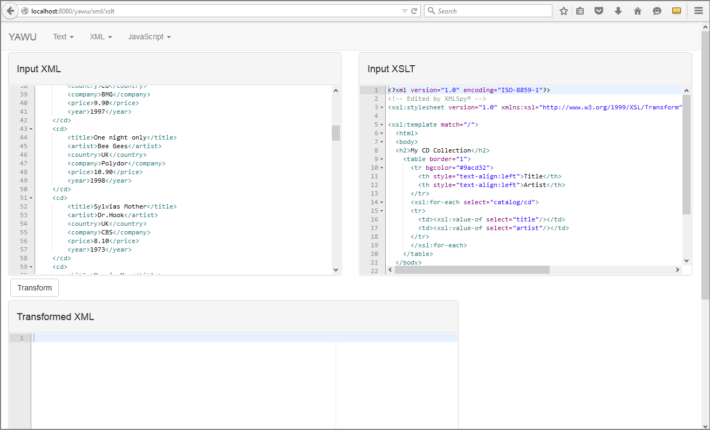
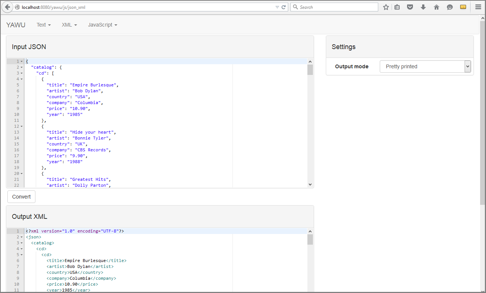

YAWU - Yet Another Web Utilities
====

Description
---

Rails app with utilities such as JSON converter, XML formatter, XSLT transformation and XSD validator.

* Licensed under the terms of the MIT license
* Developed for closed networks (e.g. for enterprise network without internet access)
* Oriented on modern browsers (mostly tested with Firefox 32)
* Uses JRuby, thus can be deployed on almost any Servlet container (e.g. Tomcat, WebSphere) using Warbler or started as standalone server.
* Can be easily extended with your own tools based on text input and output (using Ajax.org Ace editor) or uploaded files.

Use cases
---

- You need simple utility functions, but you can't use ones from Internet (for security, NDA or whatever reason)
  * you can deploy this tool on local machine or network (DON'T USE IT IN THE INTERNET)
- You need to write and share simple script with non-programmers (e.g. generating test data)
  * you can implement it and share by link
  * you can use generator to create skeleton of new tool: `bundle exec rails g editor <what_you_need>`
- (Planned feature) You need to perform chain of actions, e.g. transform JSON to XML and validate this XML by XSD
  * you can set up chain of simple transformations

Run and develop
---

It's mostly regular Rails application.
You can run it as standalone app:

```
RAILS_ENV=production bundle exec rails s
```

!!! For file uploading feature working you need `file` utility from `*nix` world.

Or build `war` and deploy to servlet container:

```
RAILS_ENV=production bundle exec rake war:create
```

It creates `yawu.war` ready for deploy. Application uses embedded database (Apache Derby), so updating `war` will erase old data.

Dockerfile for production run which embeds DB and assets is available too:
```
docker build -f docker/Dockerfile -t yawu:<version> .
docker run -it yawu:<version> -p 3000
# or using docker-compose:
cd docker && docker-compose -f docker-compose.yml up -d
```

Implemented features:
---

- XML
  * XML formatter
  * XML escaper\unescaper
  * XML -> JSON converter
  * XSLT transformations
  * XSD validation (with XSD definitions placed in multiple files)
- JavaScript
  * JSON -> XML converter
  * JSON prettifying
- Text
  * Base64 encoding/decoding
  * URL encoding/decoding

Screenshots
---




TODO list:
---

- XML
  * XSD validation with XSD definitions placed in multiple files
- JavaScript
  * JavaScript evaluator (Rhino with configurable Java context)
- misc
  * 'autosubmit' option (on input change)
  * Toolchains
  * Regexp validator (Ruby and Java syntax)
  * Unicode entity translator
  * HTTP-service stub (responses with configurable delay, status, headers and body)
  * Ping and Tracert
